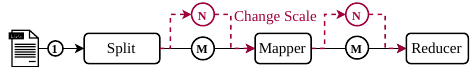

## Word Count

Workflow based on the MapReduce [example](https://github.com/ddps-lab/serverless-faas-workbench/tree/master/aws/cpu-memory/mapreduce) part of the FunctionBench paper.



## Run the Workflow (Faasm)

To run the workflow, you must first upload the wikipedia dump to S3:

```bash
# Clean bucket first
faasmctl s3.clear-bucket --bucket ${BUCKET_NAME}

# Upload all data files in the directory
faasmctl s3.upload-dir \
  --bucket ${BUCKET_NAME} \
  --host-path ${PROJ_DIR}/datasets/word-count/few-files/ \
  --s3-path word-count/few-files
```

Second, upload the WASM files for each stage in the workflow:

```bash
faasmctl upload.workflow \
  word-count \
  faasm.azurecr.io/tless-experiments:$(cat ${PROJ_DIR}/VERSION):/usr/local/faasm/wasm/word-count
```

Lastly, you may invoke the driver function to trigger workflow execution:

```bash
faasmctl invoke.wasm word-count driver --cmdline "word-count/few-files"
```

## Stages Explained

0. Driver: orchestrates function execution (could be removed)
1. Splitter: takes as an input an S3 path. Chains to one `mapper` function per
  key (i.e. file) in the S3 path.
2. Mapper: takes as an input an S3 path, and as an output writes to S3 a
  serialised map of the appearences of different programming languages in the
  wikipedia dump.
3. Reducer: once all mapper functions are done, iterates over the results S3
  dir and accumulates all results.
